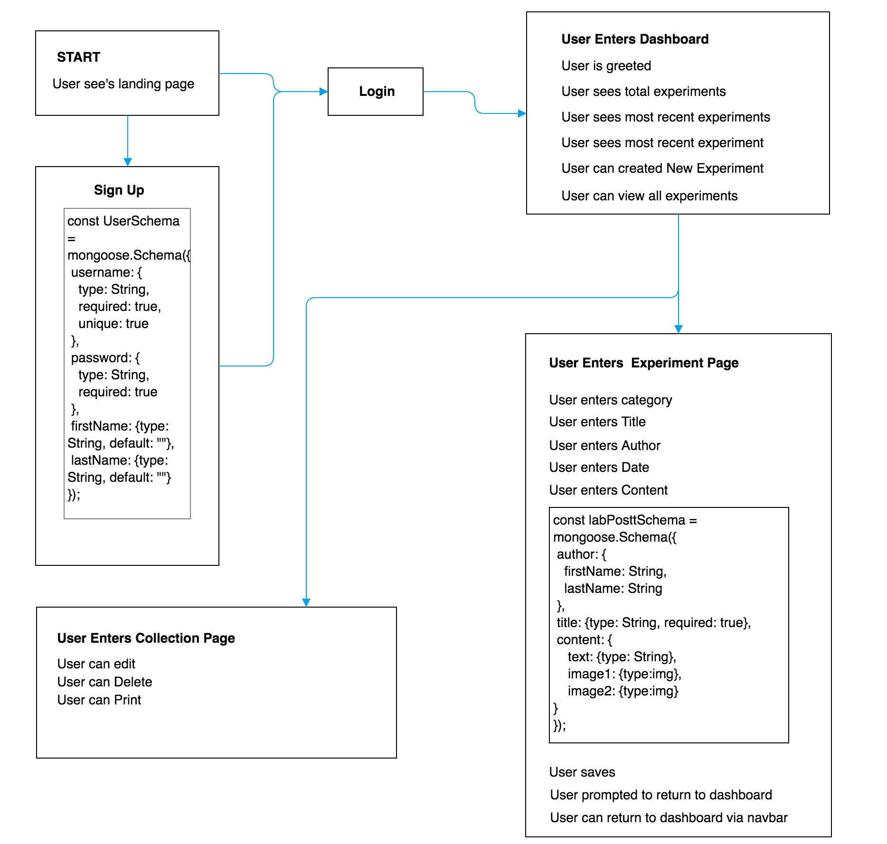
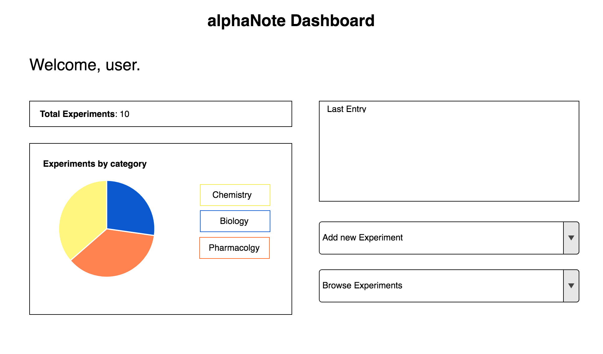
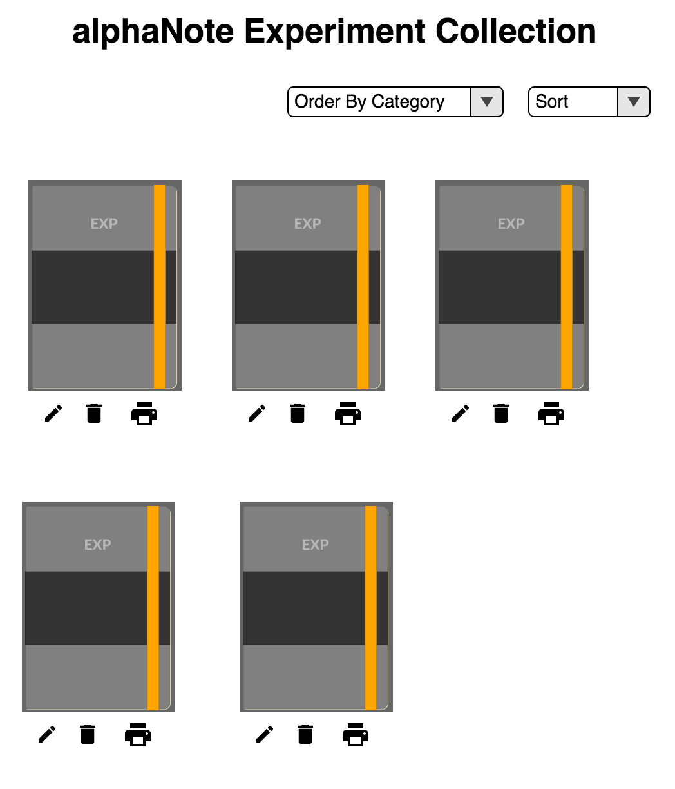
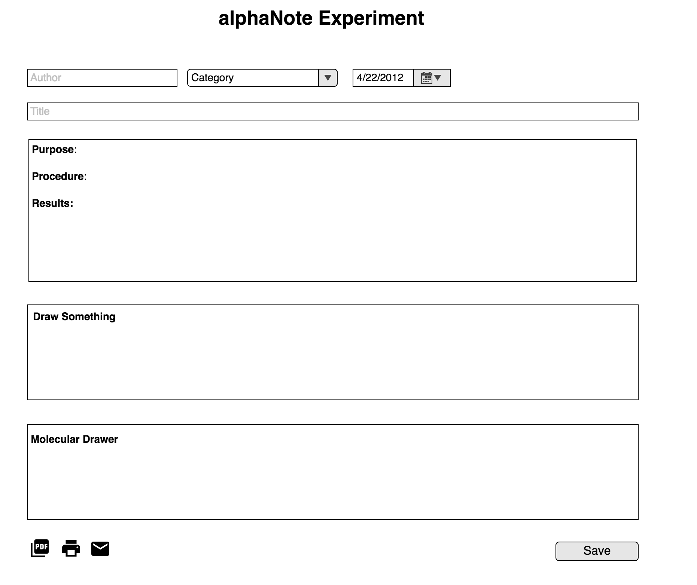

# Name: alphaNote
Best used by desktops and tablets.

## Technologies Used:

Front-End:

HTML5,CSS3,JavaScript,JQuery

Back-End:

Node.js,Express.js,Faker.js,MongoDB,Mongoose.js,Bcrypt.js,JavaSript (ES6),Mocha.js,Chai.js

Plug-Ins:

 drawingboard.js, tinyMCE, chemDoodle 

## Purpose:

To create a simple cloud based ELN (electronic laboratory notebook) for research and academic use.

## Motivation:

Paper-based laboratory notebooks are the most widely used form of experimental data tracking in labs worldwide. It´s been around for several centuries (even da Vinci had one) and you will find it in the cabinet of every scientist. But does that necessarily imply that it´s also the most efficient way of recording scientific data? Lab books are becoming the bottlenecks in information management. This poses great repeatability threats, enormous costs and considerable limitations for knowledge sharing within an organization and the community.

To be fair, paper lab books seemed to have done the job pretty well so far and there are many features that make it great; e.g. they´re inexpensive and don’t require batteries to run. Yet there are only few things we haven´t modernized for over a century, let alone a millennium. Technological advances simply make things better and you won´t find anyone doing their taxes on an abacus.

Automation and digitization enabled researchers to achieve outputs like never before. With hundreds of emerging knowledge sharing platforms, data can now be distributed globally before you can say “DNA”. The integration-based approach has allowed science to flourish and interoperability is swiftly becoming the new buzzword in modern research. Imagine all your instruments can send the analysis data directly into a single software. No more running around with USB sticks, copy-pasting, printing, cutting and gluing.

ELNs goes far beyond just being a replacement for paper.

It brings forth systematical, safe and efficient data storage along with interoperable data distribution.

## Document Flow

## MVP

